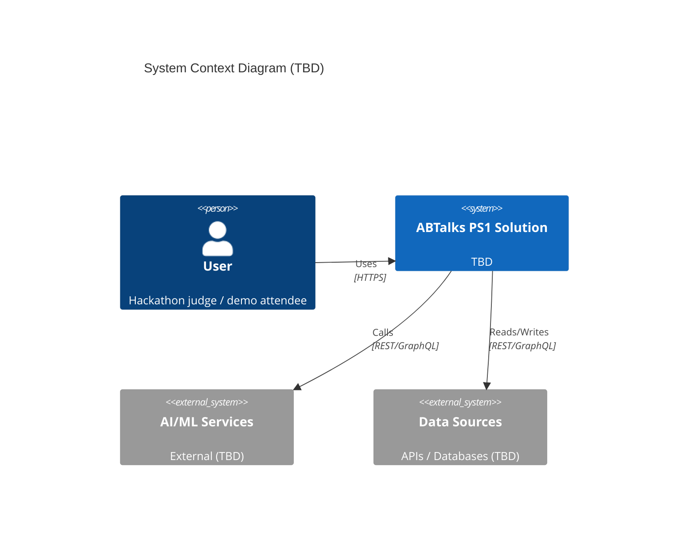
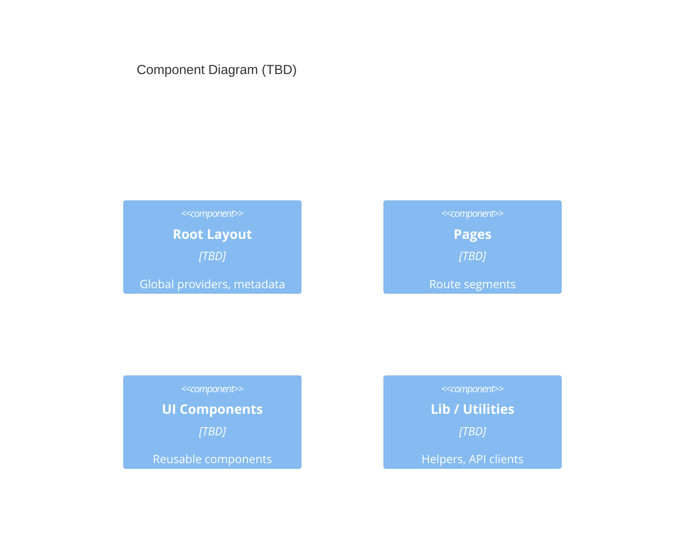

# Architecture — ABTalks PS1

> **Status**: ⚠️ **TEMPLATE** — No architecture decisions made yet. The technology stack is TBD and will be chosen in a dedicated decision phase, then recorded as ADRs in `Docs/decisions.md`. The C4 diagrams below are placeholders and must not be treated as real architecture.

---

## 1. Project Context

- **Hackathon**: ABTalks AI Hackathon — Problem Statement 1 (PS1), Redesign ABTalks
- **Team**: CTRL ALT NEXT
- **Viewport target**: 390px mobile (evaluator viewport); mobile-first, desktop secondary
- **Data**: Mock data only; no real backend, auth, or database
- **Required routes**: `/`, `/dashboard`, `/day/12`
- **Out of scope**: authentication, real user accounts, production database, recruiter dashboard, admin panel

## 2. Route Map (Confirmed)

| Route | Purpose |
|-------|---------|
| `/` | Landing page — explain ABTalks; trust, clarity, motivation to commit to the 60-day challenge |
| `/dashboard` | Student dashboard — streak, today's task, progress, overall completion, standing/achievements |
| `/day/12` | Challenge day — read the task, submit proof of work (GitHub repo/commit + LinkedIn post), submit |

---

## 3. System Context
*High-level context diagram. Fill in after stack decisions are confirmed.*



---

## 4. Container Diagram
*Deployable units. Fill in after decisions are confirmed.*

```mermaid
C4Container
    title Container Diagram (TBD)

    Container(web, "Web App", "TBD", "Serves UI, handles routing")
    ContainerDb(db, "Database", "TBD", "Persistence layer if needed (to be decided)")
    ContainerExt(ai, "AI Service", "External", "AI/ML APIs (to be decided)")
```

---

## 5. Component Diagram
*Internal structure. Fill in after decisions are confirmed.*



---

## 6. Data Flow
*Key user flows. Add after requirements and architecture are confirmed.*

---

## 7. Technology Stack Decisions
*Will be populated as ADRs in `Docs/decisions.md` are recorded.*

| Layer | Proposed | Status | ADR |
|-------|----------|--------|-----|
| Framework | Next.js App Router | ⚠️ TBD | ADR-TBD |
| Language | TypeScript (strict) | ⚠️ TBD | ADR-TBD |
| Styling | Tailwind CSS v4 | ⚠️ TBD | ADR-TBD |
| Testing | Vitest, RTL, Playwright | ⚠️ TBD | ADR-TBD |
| Deployment | Vercel | ⚠️ TBD | ADR-TBD |

---

## 8. Non-Functional Requirements Mapping
*Update as decisions are confirmed.*

| NFR | Proposed Approach | Status |
|-----|--------------------|--------|
| Mobile-first | 390px evaluator viewport; mobile-first | ✅ Confirmed (hackathon requirement) |
| Accessibility | WCAG 2.1 AA | ⚠️ TBD (proposed) |
| Performance | TBD | ⚠️ TBD |
| Security | TBD | ⚠️ TBD |
| Demo-ready | Feature flags, mock data | ✅ Confirmed (hackathon requirement) |

---

## 9. Open Architecture Questions
- [ ] Which framework? (proposed: Next.js — not confirmed)
- [ ] Which styling approach? (proposed: Tailwind CSS v4 — not confirmed)
- [ ] Do we need a database? (confirmed out of scope: no production DB)
- [ ] What AI/ML capabilities are needed?
- [ ] Real-time features? (WebSockets, SSE)
- [ ] Authentication? (confirmed out of scope)
- [ ] File upload / processing needed?
- [ ] Internationalization needed?
- [ ] Offline / PWA requirements?

---

## 10. Diagram Maintenance
- Diagrams use Mermaid (render in GitHub, VS Code, Notion)
- Update when architecture changes
- Link to ADR in `Docs/decisions.md` for each confirmed decision
