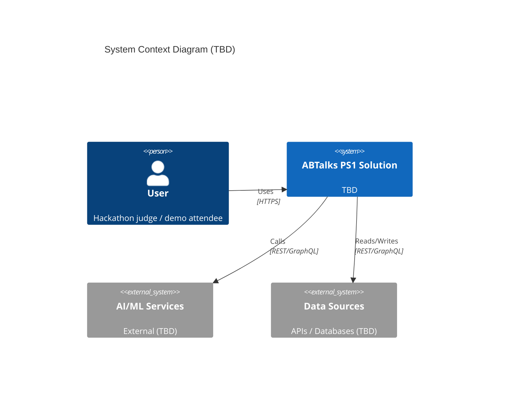
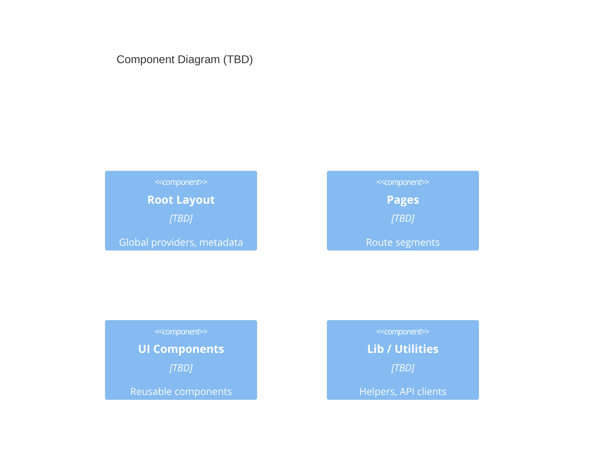

# Architecture — ABTalks PS1

> **Status**: Stack **decided** (ADR-003) — Next.js 15 App Router + TypeScript + Tailwind CSS + shadcn/ui + Framer Motion + Lucide React, deployed on Vercel, local mock JSON data, no auth/database/backend. Detailed component architecture is designed during implementation; the C4 diagrams below remain placeholders until then.

---

## 1. Project Context

- **Hackathon**: ABTalks AI Hackathon — Problem Statement 1 (PS1), Redesign ABTalks
- **Team**: CTRL ALT NEXT
- **Viewport target**: 390px mobile (evaluator viewport); mobile-first, desktop secondary
- **Stack (ADR-003)**: Next.js 15 App Router · TypeScript · Tailwind CSS · shadcn/ui + custom Bento components · Framer Motion · Lucide React · Vercel
- **Data**: Local mock JSON only; no real backend, auth, or database
- **Required routes**: `/`, `/dashboard`, `/day/12`
- **Out of scope**: authentication, real user accounts, production database, recruiter dashboard, admin panel

## 2. Route Map (Confirmed)

| Route | Purpose |
|-------|---------|
| `/` | Landing page — explain ABTalks; trust, clarity, motivation to commit to the 60-day challenge |
| `/dashboard` | Student dashboard — streak, today's task, progress, overall completion, standing/achievements |
| `/day/12` | Challenge day — read the task, submit proof of work (GitHub repo/commit + LinkedIn post), submit |

---

## 3. System Context
*High-level context diagram. Fill in after stack decisions are confirmed.*



---

## 4. Container Diagram
*Deployable units. Fill in after decisions are confirmed.*

```mermaid
C4Container
    title Container Diagram (TBD)

    Container(web, "Web App", "TBD", "Serves UI, handles routing")
    ContainerDb(db, "Database", "TBD", "Persistence layer if needed (to be decided)")
    ContainerExt(ai, "AI Service", "External", "AI/ML APIs (to be decided)")
```

---

## 5. Component Diagram
*Internal structure. Fill in after decisions are confirmed.*



---

## 6. Data Flow
*Key user flows. Add after requirements and architecture are confirmed.*

---

## 7. Technology Stack (Decided — ADR-003)

| Layer | Decision | Status | ADR |
|-------|----------|--------|-----|
| Framework | Next.js 15 (App Router) | ✅ Decided | ADR-003 |
| Language | TypeScript | ✅ Decided | ADR-003 |
| Styling | Tailwind CSS | ✅ Decided | ADR-003 |
| UI components | shadcn/ui + custom Bento components | ✅ Decided | ADR-003 |
| Animation | Framer Motion | ✅ Decided | ADR-003 |
| Icons | Lucide React | ✅ Decided | ADR-003 |
| Data | Local mock JSON only | ✅ Decided | ADR-003 |
| Auth / DB / Backend | None | ✅ Decided (out of scope) | ADR-003 |
| Deployment | Vercel | ✅ Decided | ADR-003 |
| Testing | TBD (decision deferred) | ⚠️ TBD | — |

---

## 8. Non-Functional Requirements Mapping
*Update as decisions are confirmed.*

| NFR | Proposed Approach | Status |
|-----|--------------------|--------|
| Mobile-first | 390px evaluator viewport; mobile-first | ✅ Confirmed (hackathon requirement) |
| Accessibility | WCAG 2.1 AA | ⚠️ TBD (proposed) |
| Performance | TBD | ⚠️ TBD |
| Security | TBD | ⚠️ TBD |
| Demo-ready | Feature flags, mock data | ✅ Confirmed (hackathon requirement) |

---

## 9. Open Architecture Questions

**Resolved by ADR-003 and the confirmed brief**:
- ✅ Framework: Next.js 15 App Router (ADR-003)
- ✅ Styling: Tailwind CSS (ADR-003)
- ✅ Database: none (local mock JSON; production DB out of scope)
- ✅ Authentication: none (out of scope)
- ✅ Real-time features: none (not required)
- ✅ File upload / processing: none (proof is GitHub/LinkedIn links)
- ✅ Internationalization: none (not required)
- ✅ Offline / PWA: none (not required)
- ✅ AI/ML capabilities: none prescribed by PS1

**Still open**:
- Testing tooling (unit/component/e2e) — deferred
- Component/route-level structure details — designed during implementation

---

## 10. Diagram Maintenance
- Diagrams use Mermaid (render in GitHub, VS Code, Notion)
- Update when architecture changes
- Link to ADR in `Docs/decisions.md` for each confirmed decision
